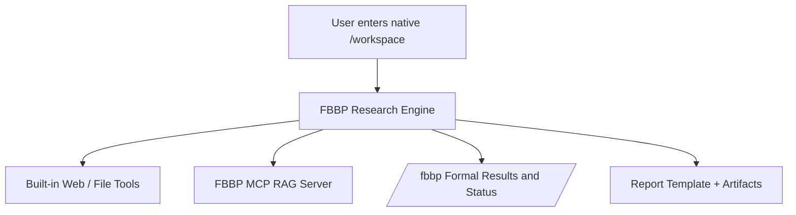

# FBBP Research Workbench

An FBBP-focused research workbench for private-knowledge-grounded literature review, database analysis, evidence synthesis, formal case execution, and report generation.

## Job-Ready Project Snapshot

This repository is now best presented as a `Biomedical Agent Control Plane` rather than a simple RAG demo.

It provides a unified product layer that routes user requests, delegates execution to existing RAG/formal/batch/report runners, records every run, and exports evaluation evidence for interview or portfolio review.

Verified capabilities and evidence:

- Full readiness baseline: `6/6` checks passing in `runs/control_plane/readiness/live_full/readiness_summary.json`
- Interview-safe fast demo: `3/3` checks passing in `runs/control_plane/readiness/job_demo_fast/readiness_summary.json`
- `50+` aggregated control-plane run records in `../llm-eval-benchmark/reports/control_plane_dashboard/latest/summary.json`
- Rule-first intent router for `private_rag`, `public_lookup`, `formal_case`, `batch_eval`, `report_generation`, and `fallback_general`
- Session memory read/write/resume with compact run summaries
- A2A-compatible v1 gateway, worker queue, retry, dead-letter handling, trace id, hop metadata, streaming, push config, and API-key auth
- Redis/Postgres queue backend adapters with local probes (`probe_redis_queue.py`, `probe_postgres_queue.py`) and file-queue fallback for offline demos
- ReAct-style trace artifacts (`react_trace.jsonl` / `react_trace.json`) for plan, tool call, observation, revision, and report phases
- Production hardening templates for Redis/Postgres queue backend, OIDC proxy auth, and A2A conformance checks
- Unified observability and agent eval metrics: route, tool success rate, memory hit, latency, cost placeholder, judge score, and preflight hit rate
- Direct project links to private RAG, MCP tool plane, eval harness, MiniMind query compiler, and upstream DeerFlow runtime
- Live portfolio dashboard service at `http://127.0.0.1:8088` backed by rebuildable snapshot artifacts
- Semantic long-term memory store with merge/conflict queue and HTML viewer

Job-search materials:

- Portfolio project page: `docs/job-ready-project-page.md`
- Chinese portfolio page: `docs/job-ready-project-page-cn.md`
- Architecture diagram: `docs/agent-control-plane-architecture.md`
- Interview demo runbook: `docs/interview-demo-runbook.md`
- Resume bullets: `docs/resume-bullets.md`
- Production hardening plan: `docs/production-hardening-plan-cn.md`
- Deployment runbook: `docs/deployment-runbook-cn.md`
- One-command demo wrapper: `scripts/demo_job_ready_control_plane.ps1`
- Full-stack launcher: `scripts/start_fbbp_fullstack.ps1`

## What This Project Provides
- A branded FBBP research workspace centered on formal, reproducible outputs
- Custom FBBP skills for multi-step deep research and structured analysis
- Checked-in formal cases, batches, and runtime profiles for stable reruns
- A private MCP retrieval layer for real FBBP database access and evidence-backed answers
- A clean separation between the product-facing FBBP shell and the underlying research engine

## Product Positioning
This repository should be read as an FBBP research product first:
- the default UI is the `FBBP Research Workbench`
- the default assistant is FBBP-specific
- the formal console and atlas package are first-class deliverables
- upstream engine provenance is preserved, but not used as the default project narrative

## Engine Provenance
The workbench is implemented on top of an upstream DeerFlow-based engine, but the user-facing product, formal workflows, and domain behaviors are collected here as an FBBP-specific layer.

See [docs/upstream-engine.md](docs/upstream-engine.md) for the explicit engine provenance and modification boundary.

## Architecture


## Repository Layout
- `configs/` — workspace configuration notes and setup guidance
- `configs/formal_cases/` — checked-in formal case definitions
- `configs/formal_batches/` — checked-in formal batch definitions
- `configs/runtime_profiles/` — shared formal runtime profiles
- `docs/` — architecture and workflow design
- `examples/` — sample research requests and report outlines
- `skills/custom/` — FBBP-specific research skills used by the workbench runtime
- `templates/` — reusable output templates
- `scripts/` — setup helpers for generating runtime config files

## Quick Start
1. Keep this monorepo layout under a single project root.
2. Ensure the machine already has `WSL`, `Python`, `Node.js`, and `pnpm`.
3. Put your model/API configuration in the checked-in project `.env` files as needed.
4. Start the local FBBP Research Workbench from the project directory:

   ```powershell
   cd <local_path_removed>
   powershell -ExecutionPolicy Bypass -File .\fbbp-research-workbench\scripts\launch_fbbp_workbench.ps1
   ```

   The launcher now opens `http://127.0.0.1:3000/workspace` by default and keeps `http://127.0.0.1:3000/fbbp` as the advanced formal results page.

The startup flow now keeps its runtime assets inside the project:
- project-local frontend runtime copy: `fbbp-research-workbench/runtime/frontend_local`
- project-local WSL MCP runtime/logs: `fbbp-research-workbench/runtime/wsl`
- project-local WSL Python packages: `fbbp-mcp-rag-server/.venv_wsl/lib/python3.12/site-packages`
- project-local workbench skills: `fbbp-research-workbench/skills`

## Current Scope
- Research request routing for FBBP questions
- Structured evidence collection from literature and domain data
- Report output template for landscape summaries and candidate comparison
- `FBBP MCP RAG Server` as the formal private knowledge service for checked-in FBBP cases and live UI queries
- `Agent Control Plane` v1 with:
  - unified entry script
  - rule-first primary routing
  - callable secondary capabilities
  - file-first formal/batch/report detection
  - parent/child run records under `runs/control_plane/`
  - A2A-compatible gateway and worker queue
  - unified observability and eval dashboard export

## Recommended First Use Cases
- Summarize FBBP scaffold categories and representative examples
- Compare candidate binders or scaffolds against a target profile
- Explain methodology, structural annotations, and evidence provenance
- Generate a compact research memo with citations and open questions

## Knowledge Connectors
- `FBBP MCP RAG Server` is the current private structured/domain connector used by the checked-in formal FBBP flow.
- The workbench runtime's built-in web and file tools cover the public literature and report-writing side of the workflow.
- The MCP server can now also provide external scientific lookups through:
  - `search_pubmed`
  - `get_uniprot_entry`
  - `get_pdb_entry`
- Optional memory stores can still be layered in later, but PubMed / UniProt / PDB are no longer just conceptual future integrations.

## Workflow Preference
The custom FBBP skills now prefer this source order:
1. `search_knowledge` for private domain facts
2. `search_pubmed` for literature grounding
3. `get_uniprot_entry` / `get_pdb_entry` for public metadata validation
4. generic web tools only when those sources still leave a gap

## MCP Setup
- Example extension config: `configs/extensions_config.fbbp.example.json`
- Core MCP tools expected from the private knowledge server:
  - `server_status`
  - `list_sources`
  - `get_document_chunk`
  - `search_knowledge`
  - `ingest_sources`
  - `search_pubmed`
  - `get_uniprot_entry`
  - `get_pdb_entry`

## Current Status
- The underlying engine baseline is kept in `../upstream-deerflow`
- This repository provides the FBBP product shell, formal run scripts, and checked-in case/batch configs.
- The private knowledge source is integrated through the sibling MCP repo at `../fbbp-mcp-rag-server`.
- The canonical full-data results package now lives under `final_results/fbbp_formal_atlas_v2026_04/`.
- Formal outputs now belong under `runs/` and `batches/`.
- Acceptance captures now belong under `artifacts/`, including `/fbbp` screenshots and status snapshots.

## Official Results Package
- Canonical package root: `final_results/fbbp_formal_atlas_v2026_04`
- Human summary: `final_results/fbbp_formal_atlas_v2026_04/atlas_overview.md`
- Scaffold appendix: `final_results/fbbp_formal_atlas_v2026_04/scaffold_atlas.csv`
- Target appendix: `final_results/fbbp_formal_atlas_v2026_04/target_registry.csv`
- Package manifest: `final_results/fbbp_formal_atlas_v2026_04/package_manifest.json`

Rebuild the official package with:

```powershell
powershell -ExecutionPolicy Bypass -File .\scripts\build_fbbp_formal_package.ps1
```

## Formal Runs
- Core startup: `scripts/start_stack_core.ps1`
- Control-plane entry: `scripts/run_fbbp_control_plane.py`
- Formal case runner: `scripts/run_fbbp_formal_case.ps1`
- Formal batch runner: `scripts/run_fbbp_formal_batch.ps1`
- Silent UI launcher: `scripts/start_deerflow_ui_silent.ps1`
- Formal acceptance capture: `scripts/capture_formal_artifacts.ps1 -Label fbbp_formal_console`
- Formal runbook: `docs/formal_runbook.md`
- Control-plane rollout blueprint: `docs/control-plane-rollout.md`
- Canonical portfolio summary: `FINAL_RESULT_SUMMARY.md`

### Control-Plane Smoke Examples
```powershell
python .\scripts\run_fbbp_control_plane.py --dry-run --mode interactive --query "总结 knottin scaffold 的私有证据"
python .\scripts\run_fbbp_control_plane.py --dry-run --mode formal --case-path .\configs\formal_cases\fbbp_knottin_landscape_01.yaml
python .\scripts\run_fbbp_control_plane.py --dry-run --mode batch --batch-path .\configs\formal_batches\weekly_validation_batch.yaml
```

### Job-Ready Demo
```powershell
powershell -ExecutionPolicy Bypass -File .\scripts\demo_job_ready_control_plane.ps1 -Fast
```

Build the live portfolio dashboard artifacts:

```powershell
powershell -ExecutionPolicy Bypass -File .\scripts\build_portfolio_dashboard.ps1
```

Run the final job-ready release gate:

```powershell
python .\scripts\control_plane\final_release_check.py
```

Start the local full-stack demo:

```powershell
powershell -ExecutionPolicy Bypass -File .\scripts\start_fbbp_fullstack.ps1
```

Start the Docker Compose support layer:

```powershell
docker compose up -d
```

For a fuller live interview check including private RAG and public lookup:

```powershell
powershell -ExecutionPolicy Bypass -File .\scripts\demo_job_ready_control_plane.ps1 -Full
```

### Control-Plane Live Notes
- `private_rag` live execution now succeeds through the unified control-plane entry.
- `formal_case` live execution now succeeds through the unified control-plane entry.
- `batch_eval` live execution now succeeds through the unified control-plane entry.
- The current interactive profile is intentionally stability-first:
  - bootstraps local WSL PostgreSQL with `scripts/start_wsl_pgvector.ps1`
  - uses a fast local retrieval profile for control-plane interactive queries
  - records the degradation choice in `run_record.json`
- The formal query gateway now:
  - accepts the renamed `fbbp_mcp_server` package while preserving legacy `fbtp_mcp_server` fallback
  - forces a stability-first retrieval profile for formal private searches
  - returns formal private search responses in tens of seconds instead of hanging on the default `bge_m3` path
- Example live run artifact:
  - `runs/control_plane/private_rag_live_demo_v6/`
  - `runs/control_plane/formal_case_live_demo_v10/`
  - `runs/control_plane/batch_eval_live_demo_v2/`
- Memory loop verification artifacts:
  - write example: `runs/control_plane/private_rag_live_demo_v7/`
  - resume example: `runs/control_plane/private_rag_memory_resume_demo_v1/`
- The checked-in agent memory file is no longer an empty placeholder:
  - `configs/agents/fbbp-assistant/memory.json` now receives compact control-plane summaries automatically
- Long-term semantic memory now writes to:
  - `runs/control_plane/memory/semantic_memory.json`
  - viewer: `reports/control_plane_portfolio_dashboard/latest/semantic_memory.html`
- Portfolio dashboard now renders:
  - final release state
  - readiness status
  - production hardening status
  - route metrics
  - recent run records
  - semantic memory highlights
  - memory item/conflict counts
- Final release gate writes:
  - `runs/control_plane/final_release/latest/final_release_summary.json`
  - `runs/control_plane/final_release/latest/final_release_summary.md`
- The `knottin` formal case now has a tool-first preflight path:
  - if the configured first `search_knowledge` call already returns enough evidence rows, the case stops before entering DeerFlow model continuation
  - the latest live report records `completion_reason=preflight:evidence_sufficient_low_confidence_answer`
- Current known runtime risk:
  - broader formal cases that still need DeerFlow planning or multi-step tool orchestration can still fail when the upstream chat API quota is exhausted

## Live UI and Status
- Primary UI: `http://127.0.0.1:3000/workspace`
- Formal results/status UI: `http://127.0.0.1:3000/fbbp`
- Formal backend status: `http://127.0.0.1:8001/api/fbbp/status`
- The status payload now reports startup warmup, startup canary, MCP reachability, and real FBBP runtime identity.

## Remaining Production Boundaries
- Real cloud deployment still needs a chosen hosting target and secrets manager.
- Redis/Postgres queue backends are adapter-ready; production activation requires real `FBBP_A2A_REDIS_URL` or `FBBP_A2A_POSTGRES_DSN`.
- OIDC hooks are implemented; production deployment still needs a real issuer/JWKS/scope policy.
- The dashboard now runs as a local HTTP control console with health, snapshot refresh, and rebuild APIs; multi-user SaaS hosting still remains a future production step.

