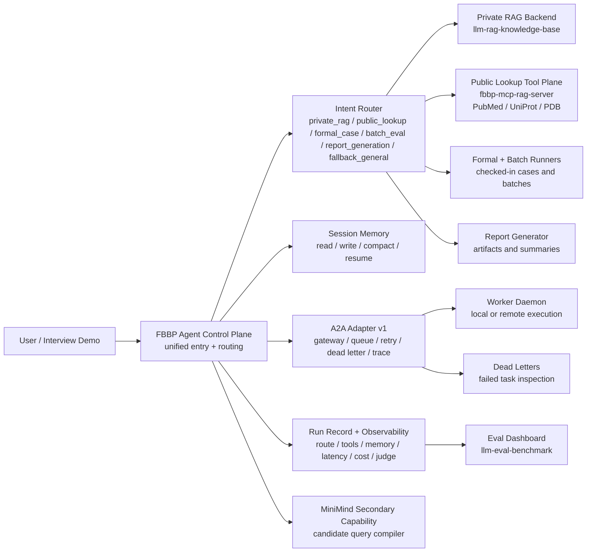

# FBBP Agent Control Plane Architecture

This is the interview-facing architecture diagram for the job-ready version of the project.

## One-Screen Diagram

## What The Diagram Means

The control plane is the product-facing layer. It does not replace the existing RAG backend, MCP tools, DeerFlow runtime, eval harness, or MiniMind lab. Instead, it coordinates them through one stable entry point.

The key engineering idea is separation of concerns:

- `fbbp-research-workbench` owns product routing, run records, memory, A2A handoff, and demo packaging.
- `llm-rag-knowledge-base` owns private knowledge retrieval and evidence-grounded answers.
- `fbbp-mcp-rag-server` owns callable tools and public biomedical lookup.
- `llm-eval-benchmark` owns aggregated run metrics and dashboard outputs.
- `minimind-fbtp-lab` owns the small-model query compiler experiment.
- `upstream-deerflow` remains the underlying runtime source, not the main product story.

## Interview Pitch

The project started as several separate biomedical AI capabilities. I turned them into an agent control plane: a rule-first routing layer that decides which workflow should run, delegates to existing specialized runners, records every execution, and exports observable metrics for debugging and evaluation.

The result is not just a prompt wrapper. It has intent routing, private and public tool execution, memory, A2A-compatible worker delegation, retry/dead-letter handling, and an evaluation dashboard.

## Verified Evidence

Current checked evidence:

- Full readiness: `runs/control_plane/readiness/live_full/readiness_summary.json`
- Eval dashboard: `../llm-eval-benchmark/reports/control_plane_dashboard/latest/summary.json`
- Dashboard CSV: `../llm-eval-benchmark/reports/control_plane_dashboard/latest/runs.csv`
- A2A gateway and worker queue: `scripts/control_plane/a2a_gateway.py`, `scripts/control_plane/worker_queue.py`, `scripts/control_plane/worker_daemon.py`
- Unified entry: `scripts/run_fbbp_control_plane.py`
- Readiness entry: `scripts/control_plane/readiness_check.py`

